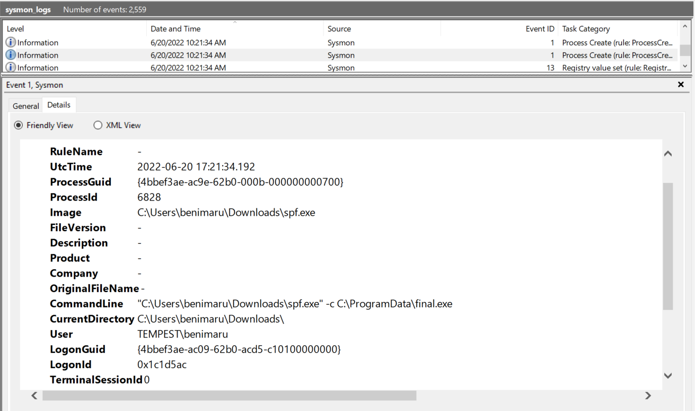

# Boogeyman Walkthrough

## Challenge Scenario

The Boogeyman is here! \
\
Julianne, a finance employee working for Quick Logistics LLC, received a follow-up email regarding an unpaid invoice from their business partner, B Packaging Inc. Unbeknownst to her, the attached document was malicious and compromised her workstation

<figure><figcaption></figcaption></figure>

The security team was able to flag the suspicious execution of the attachment, in addition to the phishing reports received from the other finance department employees, making it seem to be a targeted attack on the finance team. Upon checking the latest trends, the initial TTP used for the malicious attachment is attributed to the new threat group named Boogeyman, known for targeting the logistics sector.\
\
You (we) are tasked to analyse and assess the impact of the compromise.

## Email Analysis (Tools & Artefacts)

The room starts with providing us the artefacts that we will need to investigate & analyze. Seen below are the files contained within the artefacts folder,

<figure><figcaption>
Taking a peek at the email file, we got to list down some key information:
</figcaption></figure>

Taking a peek at the email file, we got to list down some key information:

> Sender: agriffin@bpakcaging.xyz\
> Receiver: julianne.westcott@hotmail.com\
> 1 attachment: Invoice.zip\
> Attachment password: Invoice2023!\
> DKIM-Signature: v=1; a=rsa-sha256; **d=elasticemail.com**; s=api\
> Authentication Results: spf=pass (sender IP is 15.235.99.80) smtp.mailfrom=bpakcaging.xyz;     dkim=pass (signature was verified) header.d=bpakcaging.xyz

<figure><figcaption>
I hope Julianne is really doing well, as this Arthur guy looks fishy.
</figcaption></figure>

Because we are _good people_, let's give Arthur the benefit of the doubt and check out the attached document from their email. Using Thunderbird, we downloaded the attached "Invoice.zip" and extracted its contents using the passcode in the body of the email. Turns out there really is something fishy!

<figure><figcaption>
Why is the invoice a shortcut? Only Arthur will know. Oh, I forgot about us. We can try to know!
</figcaption></figure>

I would've expected a word document or excel file contained within the zip file, but I got a shortcut (.lnk) file instead. Now we get to see some tomfoolery. Using properties viewer, or lnkparse, we get to see some interesting contents of this shortcut file.

<figure><figcaption>
The &#x3C;.lnk> file will call powershell accompanied by some encoded commands. This is incomplete so... 
</figcaption></figure>

<figure><figcaption>
...using pylnk to parse this shortcut, we get to see the full command line argument.
</figcaption></figure>

## Endpoint Security (Tools & Artefacts)

Now we know that there is&#x20;

